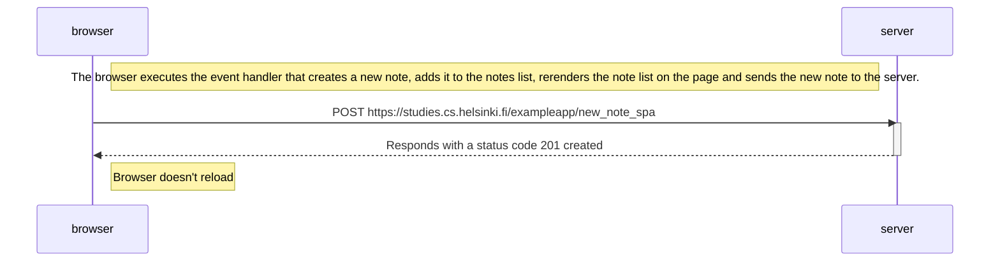

```mermaid
sequenceDiagram
    participant browser
    participant server

    Note right of browser: The browser executes the event handler that creates a new note, adds it to the notes list, rerenders the note list on the page and sends the new note to the server.

    browser->>server: POST https://studies.cs.helsinki.fi/exampleapp/new_note_spa
    activate server
    server-->>browser: Responds with a status code 201 created
    deactivate server

    Note right of browser: Browser doesn't reload
```